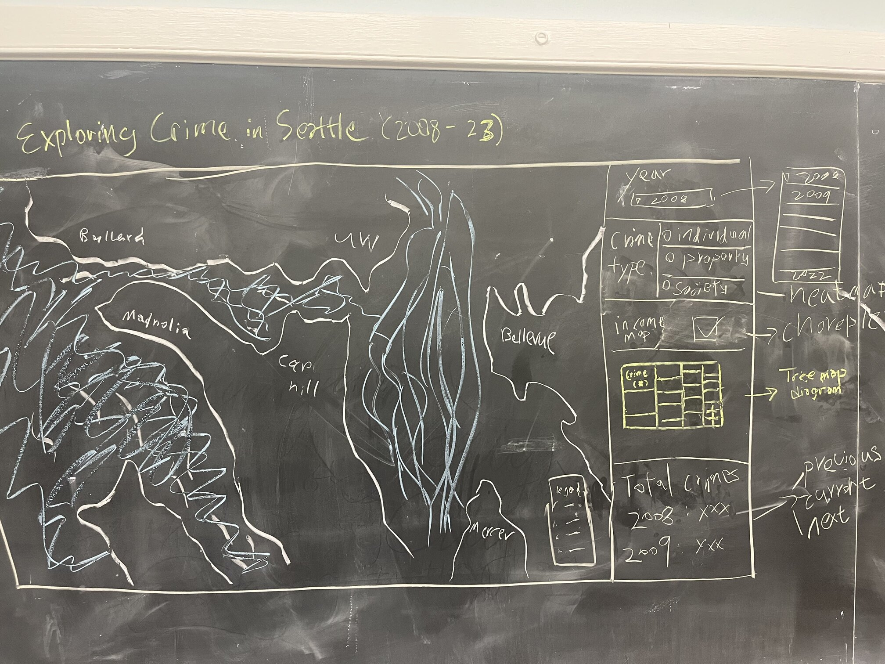

# Seattle Crime Statistics Dashboard

>[Link](https://tj717.github.io/Seattle-Crime-Stats-Dashboard/) to access the dashboard.

## 1. Project idea
 - to map and give an overview of crime rates and different types of crime within the city of Seattle. It will provide a comprehensive view of police response coverage and the trend of criminal activities. This project aims to be a one-for-all infographic site that includes different customization options, allowing users to have the most control over seeing what kind of information they need and looking for. 
## 2. Project significance and broader impacts
- this project could lead to an echo chamber effect where the past data reinforces people's existing perception of the situation and makes the situation worse. One way to go around it is to explicitly disclaim the source of the data and what exactly they show us other than records of crime reports, specifically the implications behind each crime category and their effect on people's daily lives.
## 3. Primary functions and major data sources
 - the primary function of the map is to generate and query different statistics from the dataset, such as crime records in the year 2015, or the crimes against society. The major data source is Seattle Open Data Portal's crime records dataset.
## 4. Targeted audience
 - people who live in or plan to live in Seattle: provide a brief introduction to the different neighborhoods in Seattle along with locations of the crime reports that people should be aware of.

 - the police force: a quick overlook of which area/time period should be more police patrolling taking place.

 - policymakers: use this as a reference to identify potential problems and biases in existing policies when it comes to government regulations.
## 5. Multimedia (e.g., external links, texts, images, youtube videos, etc.)
 - Prototype drawing of the dashboard:

 - Heat map of crime records filtered by year

 - Treemap

Treemap example of what we'll have on the sidebar of the dashboard. As years change. the treemap will change as well and show the frequencies of crime categories by year to display any sort of change the frequencies of these crimes might go through.

## 6. Project format: Smart dashboard
  #### map projection, map zoom levels, center:
   - Mercator, zoom level: 10.2, center: [-122.322, 47.6226]
  #### descriptions of the base map you plan to use.
   - A simple light theme street map that doesn’t distract from our visualizations
  #### description of the thematic layers you will make.
   - Heat map for crime frequency. Choropleth for medium income map
   - Heat map: Seattle crime records. Choropleth: Seattle neighborhoods medium income
  #### Vector data, interval, and nominal attribute
  #### proposed interactive functions:
  - Visualization components in the right-side panel.
  - The side panel is collapsible and scrollable if the content can't fit on the page.
  - The map title and button to the disclaimer popup are in the top-left corner
  - a dropdown menu for selecting the year
  - a multiple-choice field for selecting the crime type
  - an option to income a map of median income by neighborhood at the corner
  - a treemap of crime distribution
  - a statistics table for a summary of crimes on the map
  #### What are the coordinated charts you plan to make?
 - Treemap using D3.js's treemap function, visualizing types of crimes and their percentages.
 - Statistics table using basic data querying showing the selected year, the previous year, and the next year's total crime records in a certain category to show a year-to-year comparison.
